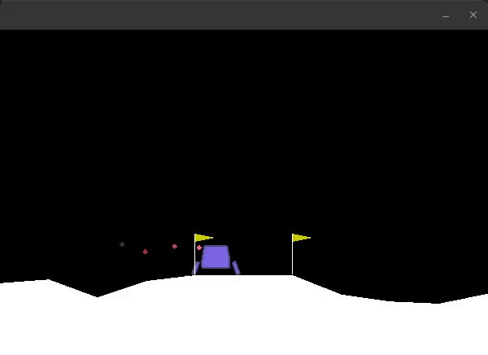

# JuliaRL

This is the code I developed for my Bachelor's thesis work *Reinforcement Learning in Julia, using a multi-objective environment*.
I use the [ReinforcementLearning.jl](https://github.com/JuliaReinforcementLearning/ReinforcementLearning.jl) package to apply DQN algorithms to a modified version of the [Lunar Lander](https://gym.openai.com/envs/LunarLander-v2/) environment, from the [Open AI Gym](https://github.com/openai/gym) python library. The Julia code uses the python environment through the [PyCall.jl](https://github.com/JuliaPy/PyCall.jl) package.

## Installation
Clone the progect:
```
$ git clone https://github.com/FeLusiani/JuliaRL
$ cd ./JuliaRL
```

Inside the `julia` REPL, use `]` to enter the `Pkg` REPL. Use `activate .` to activate the environment and `instantiate` to install the required dependencies.

### Installing JuliaRL/CustomGym
To make the `JuliaRL/CustomGym` python package available to `PyCall`, you will need to install it using the [Conda.jl](https://github.com/Luthaf/Conda.jl) package. Alternatively, you can directly install it using the `pip` binary in `~/.julia/conda/3/bin/pip`:
```
$ ~/.julia/conda/3/bin/pip install ~/JuliaRL/CustomGym
```

## Usage
Inside the `julia` REPL:
```
julia> include("./src/JuliaRL.jl")
```
To train the agent using the [Priorized-DQN algorithm](https://github.com/JuliaReinforcementLearning/ReinforcementLearningZoo.jl/blob/master/src/algorithms/dqns/prioritized_dqn.jl) from the `ReinforcementLearning` package:
```
julia> runPDQN("./checkpoints/PDQN_test")
Progress:   3%|██▉                               |  ETA: 0:02:38
```

When it's finished, it should print
```
Progress: 100%|██████████████████████████████████| Time: 0:02:06
[ Info: saving agent to ./checkpoints/PDQN_test ...
[ Info: finished saving agent in 0.216737564 seconds
126.683827 seconds (1.30 G allocations: 75.891 GiB, 8.71% gc time)
```

To load the agent and see it in action:
```
julia> display_agent("./checkpoints/PDQN_test/")
```


